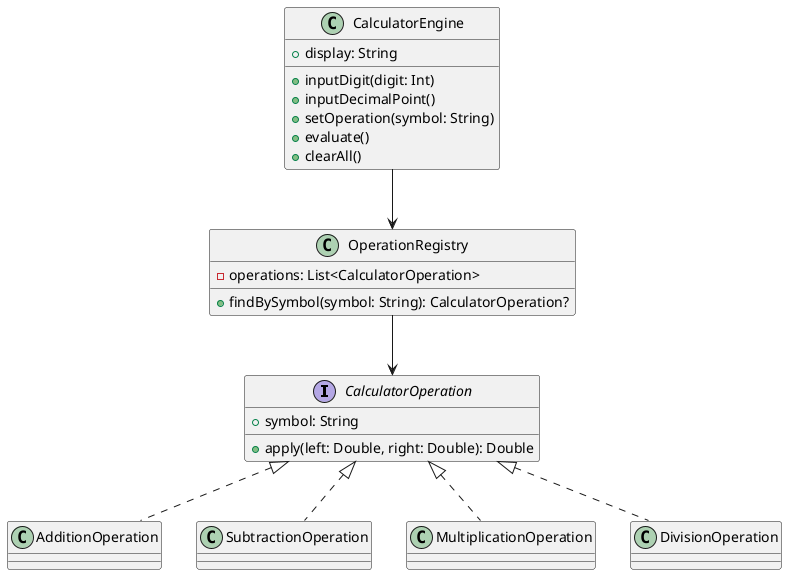

# Лабораторная работа №1

## Тема
Создание программного обеспечения «Простой калькулятор» на Compose Multiplatform (аналог WPF/C#).

## Цель работы
Разработать простое графическое приложение калькулятора, реализовать базовые арифметические операции, применить принципы ООП и проверить корректность работы.

## Используемые технологии
- Kotlin
- Compose Multiplatform Desktop
- Gradle
- kotlin.test для модульного тестирования

## Постановка задачи
Реализовать калькулятор с:
- вводом чисел и десятичной точки;
- операциями +, -, *, /;
- отображением результата;
- кнопками C и =;
- поддержкой клавиатурного ввода;
- структурированным ООП-кодом.

## Ход выполнения
1. Создан интерфейс калькулятора: поле вывода и сетка кнопок.
2. Реализовано вычислительное ядро `CalculatorEngine`.
3. Реализованы арифметические операции через интерфейс `CalculatorOperation` и полиморфные классы операций.
4. Добавлена поддержка ввода с клавиатуры (цифры, операции, Enter, Escape).
5. Добавлены модульные тесты для ядра калькулятора.

## ООП в работе
- Инкапсуляция: состояние калькулятора хранится внутри `CalculatorEngine`.
- Наследование: классы операций реализуют общий интерфейс `CalculatorOperation`.
- Полиморфизм: вычисление выполняется через единый метод `apply(...)`, независимо от конкретной операции.

## Диаграмма классов (PlantUML)


## Тестирование
Проверены сценарии:
- сложение целых;
- умножение десятичных;
- деление на ноль;
- очистка состояния.

Запуск тестов:
```bash
./gradlew.bat :composeApp:jvmTest
```

## Вывод
Разработан рабочий калькулятор, соответствующий функциональным требованиям лабораторной работы. Применены базовые принципы ООП, реализовано тестирование бизнес-логики.

---

## Контрольные вопросы и ответы

1. Назовите преимущества выбранной современной технологии (например, WPF) по сравнению со старой (например, Windows Forms).

Ответ:
Compose Multiplatform (как и WPF в своем стеке) использует декларативный подход к UI: интерфейс описывается как функция состояния. Это упрощает сопровождение, уменьшает количество ручной синхронизации между логикой и UI, облегчает переиспользование компонентов и масштабирование приложения. По сравнению со старыми событийно-формовыми подходами код менее связан и более тестируем.

2. Что такое «Парадигма программирования».

Ответ:
Парадигма программирования - это модель мышления и набор принципов, по которым строится программа: как организуются данные, поведение, зависимости и поток управления.

3. Какие существуют основные парадигмы программирования.

Ответ:
Основные: императивная, процедурная, объектно-ориентированная, функциональная, логическая, декларативная. На практике часто применяется мультипарадигменный подход.

4. Что такое шаблоны проектирования или паттерны?

Ответ:
Шаблоны проектирования - это типовые, проверенные решения повторяющихся задач проектирования ПО. Они описывают структуру взаимодействия классов и объектов, а не готовый код.

5. Назовите виды шаблонов проектирования.

Ответ:
Три основные группы GoF: порождающие, структурные, поведенческие.

6. Какие преимущества и недостатки имеются в применении шаблонов проектирования?

Ответ:
Преимущества: ускоряют проектирование, повышают читаемость архитектуры, уменьшают связность, улучшают расширяемость и тестируемость.
Недостатки: возможное переусложнение, избыточные абстракции, рост порога входа для новых разработчиков.

7. Что такое «антипаттерн»?

Ответ:
Антипаттерн - это распространенный, но неэффективный подход к решению задачи, который обычно приводит к проблемам в сопровождении, производительности или надежности.

8. В чем разница между поведенческими, структурными и порождающими паттернами?

Ответ:
Порождающие паттерны отвечают за создание объектов.
Структурные - за композицию классов/объектов и построение более крупных структур.
Поведенческие - за алгоритмы и взаимодействие между объектами.
