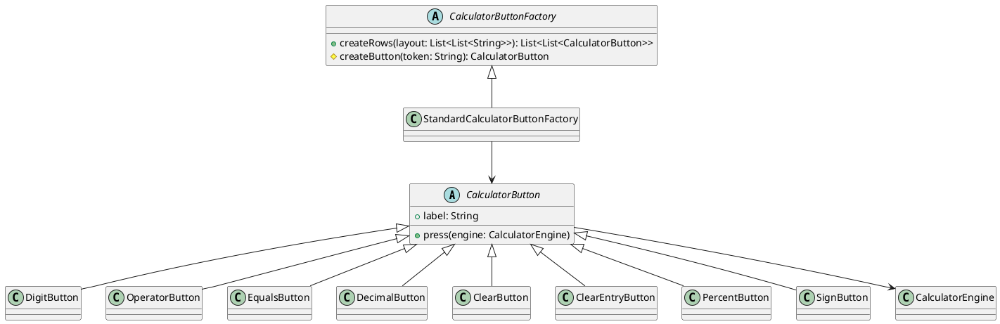

# Лабораторная работа №2

## Тема
Порождающие шаблоны проектирования в приложении калькулятора.

## Цель работы
Изучить порождающие паттерны и применить один из них в реальном приложении для повышения гибкости и расширяемости кода.

## Выбранный паттерн
Factory Method (Фабричный метод).

## Обоснование выбора
В калькуляторе есть семейство кнопок с разным поведением (цифровые, операционные, функциональные). Factory Method централизует создание объектов кнопок, отделяет UI от конкретных классов кнопок и упрощает добавление новых типов без изменения клиентского кода.

## Ход выполнения
1. Создана иерархия кнопок:
- `CalculatorButton` (абстрактная базовая кнопка)
- `DigitButton`, `OperatorButton`, `EqualsButton`, `DecimalButton`, `ClearButton`, `ClearEntryButton`, `PercentButton`, `SignButton`
2. Создана фабрика:
- `CalculatorButtonFactory`
- `StandardCalculatorButtonFactory`
3. UI переведен на работу через фабрику: кнопки создаются по токенам layout.
4. Ядро калькулятора расширено методами `clearEntry`, `applyPercent`, `toggleSign`.
5. Добавлены модульные тесты для фабрики и функциональных операций.

## Диаграмма классов (PlantUML)


## Тестирование
Проверены:
- корректное создание типов кнопок фабрикой;
- функциональные операции `CE`, `%`, `+/-`;
- регрессия базовых арифметических сценариев.

Запуск тестов:
```bash
./gradlew.bat :composeApp:jvmTest
```

## Вывод
Паттерн Factory Method успешно внедрен. Код стал более модульным и готовым к расширению (например, для научных или memory-кнопок).

---

## Контрольные вопросы и ответы

1. Что такое порождающие паттерны проектирования и их назначение? Опишите, как они помогают в создании объектов.

Ответ:
Порождающие паттерны - это шаблоны, управляющие созданием объектов. Они скрывают детали инстанцирования, уменьшают связанность клиентского кода с конкретными классами и позволяют гибко менять способ создания объектов.

2. Перечислите основные порождающие паттерны проектирования. Укажите, для чего каждый используется.

Ответ:
- Singleton - гарантирует единственный экземпляр класса.
- Factory Method - делегирует создание объектов подклассам/фабрикам.
- Abstract Factory - создает семейства взаимосвязанных объектов.
- Builder - поэтапно собирает сложный объект.
- Prototype - создает новые объекты копированием прототипа.

3. Какой паттерн используется для создания объектов без указания конкретного класса? Объясните принцип работы паттерна "Фабрика".

Ответ:
Factory Method. Клиент запрашивает объект через фабричный интерфейс, не зная конкретного класса. Выбор конкретной реализации инкапсулирован в фабрике.

4. В чем разница между паттернами "Одиночка" и "Фабрика"? Приведите примеры использования.

Ответ:
Singleton управляет количеством экземпляров (обычно один).
Factory управляет способом создания разных объектов.
Примеры:
- Singleton: глобальный конфиг приложения.
- Factory: создание разных кнопок калькулятора по токену.

5. В чем разница между "Фабрика" и "Абстрактная фабрика"? Приведите примеры.

Ответ:
Factory Method обычно создает один продукт (или продукты одной линии) через метод.
Abstract Factory создает целое семейство согласованных продуктов.
Пример:
- Factory Method: создание кнопки по символу.
- Abstract Factory: создание набора UI-компонентов под разные темы/платформы.

6. Как паттерн "Строитель" помогает в создании сложных объектов?

Ответ:
Builder разделяет процесс пошаговой сборки объекта и его финальное представление. Это удобно, когда объект имеет много параметров и разные варианты конфигурации.

7. Что такое "Прототип" и как он используется?

Ответ:
Prototype создает новые объекты путем копирования существующего экземпляра. Полезен, когда создание объекта дорогое или сложное, а состояние можно клонировать.

8. Приведите пример использования "Абстрактной фабрики".

Ответ:
Например, фабрика UI-набора: `DesktopWidgetFactory` и `MobileWidgetFactory`, каждая создает согласованный комплект кнопок, полей ввода и диалогов для своей платформы.

9. Как порождающие паттерны улучшают тестируемость кода?

Ответ:
Они способствуют инверсии зависимостей: клиент зависит от абстракций, а не от конкретных классов. Это позволяет подменять реализации тестовыми объектами и изолированно тестировать модули.

10. Какой порождающий паттерн выбрать для системы, где создаются разные типы объектов в зависимости от конфигурации?

Ответ:
Часто оптимален Factory Method или Abstract Factory. Для текущего калькулятора выбран Factory Method, так как он проще и достаточно гибок для создания разных кнопок по конфигурационным токенам.

11. Как порождающие паттерны помогают в управлении жизненным циклом объектов?

Ответ:
Они централизуют создание и могут включать стратегии кеширования, переиспользования и контроля ресурсоемких объектов. Это упрощает контроль и освобождение ресурсов.
