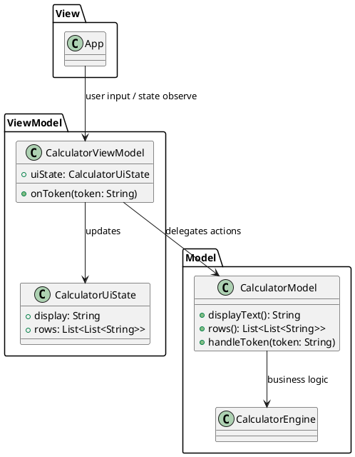
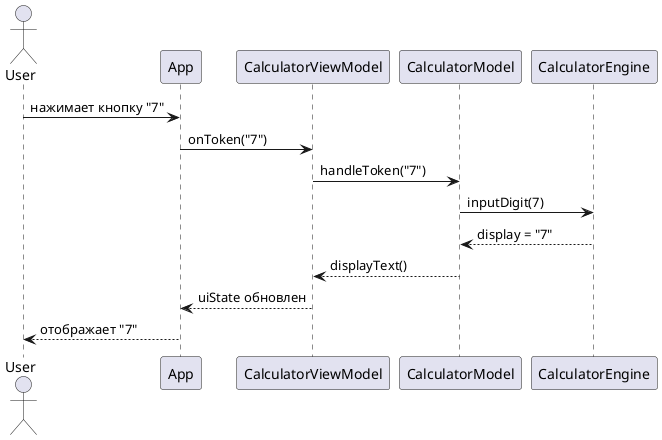

# Лабораторная работа №3

## Тема
Архитектурные шаблоны ПО. Реализация калькулятора с использованием MVVM.

## Цель работы
Изучить архитектурные шаблоны и применить MVVM для разделения ответственности между представлением, состоянием UI и бизнес-логикой.

## Выбранный архитектурный шаблон
MVVM (Model-View-ViewModel).

## Реализация в проекте
- Model: `CalculatorModel` + `CalculatorEngine` (бизнес-логика, обработка токенов, состояние вычислений).
- ViewModel: `CalculatorViewModel` (хранит `CalculatorUiState`, принимает действия пользователя `onToken(...)`).
- View: `App` (Compose UI, отображение состояния и отправка событий во ViewModel).

## Ход выполнения
1. Выделен слой `mvvm` с классами Model/ViewModel/UiState.
2. View переведен на чтение состояния из ViewModel.
3. UI больше не содержит бизнес-правил арифметики.
4. Добавлены тесты ViewModel.

## Диаграмма архитектуры (PlantUML)


## Диаграмма последовательности (PlantUML)


## Тестирование
Проверены:
- расчет через ViewModel;
- функциональные кнопки через ViewModel;
- сохранение корректного UI state.

Запуск тестов:
```bash
./gradlew.bat :composeApp:jvmTest
```

## Вывод
MVVM улучшил модульность, тестируемость и сопровождаемость проекта: бизнес-логика отделена от интерфейса, View стала тонкой и декларативной.

---

## Контрольные вопросы и ответы

1. Что такое архитектурный шаблон проектирования и какова его роль в разработке ПО?

Ответ:
Архитектурный шаблон - это типовой способ организации крупных частей системы и их взаимодействия. Он задает структуру приложения, снижает хаотичность кода и повышает предсказуемость разработки.

2. Перечислите основные архитектурные шаблоны и кратко опишите каждый.

Ответ:
- Layered Architecture: разделение на слои (UI, бизнес-логика, данные).
- MVC: Model, View, Controller.
- MVVM: Model, View, ViewModel (удобен для data/state binding).
- Microservices: система из независимых сервисов.
- Clean Architecture: слои с направлением зависимостей внутрь домена.

3. Каковы преимущества и недостатки использования архитектурных шаблонов?

Ответ:
Преимущества: ясная структура, масштабируемость, переиспользование, проще командная разработка.
Недостатки: первоначальная сложность, риск переархитектурить небольшой проект, дополнительные абстракции.

4. Что такое масштабируемость приложения?

Ответ:
Масштабируемость - способность системы расти по функциональности, нагрузке и команде разработки без деградации качества. Архитектурные шаблоны помогают разделять зоны ответственности, но могут добавлять накладные расходы на координацию слоев.

5. Как архитектурные шаблоны влияют на тестируемость приложения?

Ответ:
При хорошем разделении зависимостей модули тестируются изолированно (например, ViewModel и Model без UI). Если шаблон применен формально и слои сильно связаны, тестирование усложняется.

6. Приведите примеры реальных приложений, использующих архитектурные шаблоны.

Ответ:
- Мобильные приложения Android часто используют MVVM (Jetpack).
- Веб-приложения часто построены на MVC (ASP.NET MVC, Spring MVC).
- Крупные облачные платформы используют микросервисную архитектуру.
Выбор шаблона влияет на развертывание, поддержку и тестовую стратегию.

7. Как выбрать подходящий архитектурный шаблон для конкретного проекта?

Ответ:
Оцениваются размер проекта, требования к скорости разработки, тестируемости, производительности, распределенности команды, ожидаемому росту функциональности и инфраструктуре.

8. Что такое "Чистая архитектура" и чем она отличается от других шаблонов?

Ответ:
Чистая архитектура строится вокруг доменной логики, а зависимости направляются внутрь. Внешние детали (UI, БД, фреймворки) изолируются интерфейсами. Отличие - строгий контроль зависимостей и приоритет домена.

9. Как архитектурные шаблоны помогают в управлении зависимостями?

Ответ:
Они задают правила взаимодействия модулей и позволяют внедрять зависимости через абстракции. Это снижает связанность, улучшает модульность и упрощает замену компонентов.
