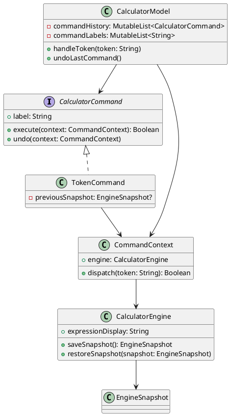

# Лабораторная работа 4
## Поведенческие шаблоны проектирования

## Цель работы
Изучить и применить поведенческий шаблон проектирования Command в приложении калькулятора на Kotlin Compose Multiplatform.

## Постановка задачи
Необходимо провести рефакторинг калькулятора с использованием поведенческого паттерна Command, обеспечить ведение истории команд, реализовать механизм отмены действий и обновить пользовательский интерфейс.

## Выбранный поведенческий паттерн
Использован шаблон Command.

Преимущества для проекта:
- Инкапсуляция пользовательского действия в отдельный объект команды.
- Возможность хранить историю выполненных действий.
- Реализация undo через восстановление предыдущего снимка состояния.
- Снижение связанности между UI и движком вычислений.

## Выполненные изменения
1. В `CalculatorEngine` добавлены:
- снимок состояния `EngineSnapshot`;
- методы `saveSnapshot()` и `restoreSnapshot()`;
- отображение текущего выражения `expressionDisplay`.

2. Добавлен командный слой:
- интерфейс `CalculatorCommand`;
- контекст выполнения `CommandContext`;
- конкретная команда `TokenCommand`.

3. В модели `CalculatorModel` реализованы:
- очередь истории команд;
- запуск команд через `handleToken`;
- отмена последней команды `undoLastCommand`.

4. В `CalculatorViewModel` и `CalculatorUiState` добавлены:
- поле истории `commandHistory`;
- флаг доступности отмены `canUndo`;
- метод `onUndo()`.

5. В интерфейсе `App` реализованы:
- выезжающее боковое меню с историей команд;
- кнопка отмены последней команды;
- горячая клавиша `Ctrl+Z` для undo.

## Измененные файлы
- `composeApp/src/jvmMain/kotlin/me/obektev/calc/CalculatorEngine.kt`
- `composeApp/src/jvmMain/kotlin/me/obektev/calc/mvvm/CalculatorCommand.kt`
- `composeApp/src/jvmMain/kotlin/me/obektev/calc/mvvm/CalculatorModel.kt`
- `composeApp/src/jvmMain/kotlin/me/obektev/calc/mvvm/CalculatorViewModel.kt`
- `composeApp/src/jvmMain/kotlin/me/obektev/calc/mvvm/CalculatorUiState.kt`
- `composeApp/src/jvmMain/kotlin/me/obektev/calc/App.kt`
- `composeApp/src/jvmTest/kotlin/me/obektev/calc/CalculatorEngineTest.kt`
- `composeApp/src/jvmTest/kotlin/me/obektev/calc/CalculatorViewModelTest.kt`

## Диаграмма классов


## Скриншоты


## Тестирование
Запуск тестов:
```log
./gradlew :composeApp:jvmTest
BUILD SUCCESSFUL
```

Добавленные тестовые сценарии:
- отображение выражения до нажатия `=`;
- возврат к прошлому состоянию через snapshot/restore;
- работа истории и undo на уровне ViewModel.

## Ответы на контрольные вопросы
### 1. Что такое поведенческие шаблоны и какова их цель?
Поведенческие шаблоны определяют способы взаимодействия объектов и распределения ответственности между ними. Их основная цель: сделать поведение системы более гибким, расширяемым и менее связанным.

### 2. Три основных поведенческих шаблона
1. Command: инкапсулирует действие в объект команды. Пример: кнопка калькулятора как команда.
2. Strategy: позволяет менять алгоритм во время выполнения. Пример: переключение способов форматирования результата.
3. Observer: реализует подписку и уведомления. Пример: обновление UI при изменении модели.

### 3. Шаблон для подписки и уведомления
Observer. Он позволяет подписчикам получать уведомления об изменениях без жесткой связи с источником событий.

### 4. Разница между Strategy и State
Strategy меняет алгоритм, выбранный клиентом. State меняет поведение объекта в зависимости от внутреннего состояния.

### 5. Как поведенческие паттерны улучшают гибкость
Они разделяют обязанности, уменьшают связанность и позволяют добавлять новое поведение через расширение, а не переписывание существующего кода.

### 6. Как Command реализует undo
Каждая команда хранит снимок состояния до выполнения. При отмене восстанавливается снимок, и система возвращается в предыдущее состояние.

### 7. Что такое Mediator
Mediator централизует коммуникацию объектов через посредника, уменьшая прямые зависимости между компонентами.

### 8. Поведенческие паттерны в многопоточности
Полезны Command и Observer: команды можно ставить в очередь, а подписки использовать для потокобезопасных уведомлений.

## Вывод
В рамках ЛР4 выполнен рефакторинг калькулятора с применением паттерна Command, реализованы история действий и undo, подтверждена работоспособность тестами. Архитектура стала более гибкой и удобной для дальнейшего расширения.
