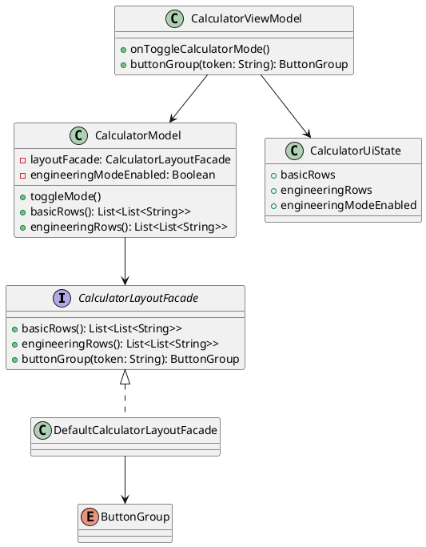

# Лабораторная работа 5
## Структурные шаблоны проектирования

## Цель работы
Изучить и применить структурные паттерны проектирования для повышения гибкости и расширяемости калькулятора.

## Постановка задачи
Требуется провести рефакторинг калькулятора, внедрить структурный паттерн, реализовать переключение режимов обычный/инженерный, разделить функциональные блоки кнопок по цветам и улучшить визуальную организацию интерфейса.

## Выбранный структурный паттерн
Использован паттерн Facade в виде `CalculatorLayoutFacade`.

Почему Facade:
- скрывает детали формирования раскладки кнопок;
- предоставляет единый API для получения базовых и инженерных рядов;
- централизует правила группировки кнопок по функциональным категориям;
- упрощает дальнейшее расширение UI без изменения бизнес-логики.

## Реализация
Созданы новые сущности:
- `ButtonGroup` для функциональной классификации кнопок;
- `CalculatorLayoutFacade` как интерфейс фасада;
- `DefaultCalculatorLayoutFacade` как реализация фасада.

Обновления модели:
- `CalculatorModel` получает раскладки через фасад;
- реализовано состояние `engineeringModeEnabled`;
- добавлен метод `toggleMode()`.

Обновления ViewModel/UI:
- `CalculatorUiState` расширен полями `basicRows`, `engineeringRows`, `engineeringModeEnabled`;
- добавлен метод `onToggleCalculatorMode()`;
- в интерфейсе добавлена кнопка переключения режима;
- инженерные кнопки отображаются плавно через `AnimatedVisibility`.

Цветовое разделение блоков:
- память: отдельный цвет;
- инженерные функции: отдельный цвет;
- операторы: отдельный цвет;
- цифры: отдельный цвет;
- управляющие кнопки: отдельный цвет.

## Измененные файлы
- `composeApp/src/jvmMain/kotlin/me/obektev/calc/mvvm/CalculatorLayoutFacade.kt`
- `composeApp/src/jvmMain/kotlin/me/obektev/calc/mvvm/CalculatorModel.kt`
- `composeApp/src/jvmMain/kotlin/me/obektev/calc/mvvm/CalculatorUiState.kt`
- `composeApp/src/jvmMain/kotlin/me/obektev/calc/mvvm/CalculatorViewModel.kt`
- `composeApp/src/jvmMain/kotlin/me/obektev/calc/App.kt`
- `composeApp/src/jvmTest/kotlin/me/obektev/calc/CalculatorViewModelTest.kt`

## Диаграмма классов


## Скриншоты


## Тестирование
```log
./gradlew :composeApp:jvmTest
BUILD SUCCESSFUL
```

Проверено:
- переключение режима `обычный/инженерный`;
- доступность инженерных рядов в инженерном режиме;
- корректная работа ранее реализованных функций.

## Ответы на контрольные вопросы
### 1. Что такое структурные паттерны?
Структурные паттерны описывают способы композиции классов и объектов для получения более гибкой архитектуры и снижения связанности.

### 2. Основные структурные паттерны
1. Adapter: согласует несовместимые интерфейсы.
2. Decorator: динамически добавляет поведение объекту.
3. Facade: предоставляет упрощенный единый интерфейс к сложной подсистеме.
4. Composite: строит древовидные структуры объект-часть.
5. Proxy: контролирует доступ к объекту-заместителю.

### 3. Как Adapter решает несовместимость интерфейсов
Adapter оборачивает существующий объект и переводит вызовы в ожидаемый формат клиента.

### 4. Разница между Decorator и Composite
Decorator расширяет поведение конкретного объекта, Composite объединяет объекты в иерархию часть-целое.

### 5. Как Facade упрощает подсистемы
Facade скрывает внутренние детали и дает короткий API. В данной работе фасад инкапсулирует раскладки и группировку кнопок.

### 6. Что такое Bridge
Bridge разделяет абстракцию и реализацию, позволяя развивать их независимо.

### 7. Когда применять Prototype
Когда создание объекта дорогое и выгодно копировать уже готовый экземпляр.

### 8. Влияние структурных паттернов на гибкость
Они помогают локализовать изменения и расширять систему с минимальным влиянием на остальной код.

### 9. Proxy для контроля доступа
Proxy может проверять права, логировать обращения и кешировать результаты перед передачей запроса реальному объекту.

### 10. Как улучшить читаемость и поддержку
Разделять ответственность по слоям, вводить фасады и адаптеры на стыках модулей, ограничивать прямые зависимости.

## Вывод
В ЛР5 в проект внедрен структурный паттерн Facade, реализованы два режима калькулятора с плавной анимацией инженерных кнопок и цветовым разделением функциональных блоков. Это повысило расширяемость интерфейса и улучшило читаемость архитектуры.
