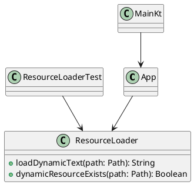

# Лабораторная работа 6
## Ресурсы приложения

## Цель работы
Изучить и применить работу с ресурсами в оконном приложении на Compose Desktop: меню, иконки, курсоры, диалоги, статическая и динамическая загрузка ресурсов.

## Постановка задачи
Необходимо добавить ресурсную инфраструктуру в проект калькулятора и продемонстрировать доступ к ресурсам из кода приложения.

## Выполненные этапы
### 1. Добавление меню приложения
В desktop-окно добавлено меню `Приложение` с пунктом `Выход`.

### 2. Добавление иконки
Создан векторный ресурс:
- `composeApp/src/jvmMain/composeResources/drawable/app_badge.xml`

Иконка отображается в интерфейсе калькулятора (в верхней панели).

### 3. Создание ресурсной структуры
Добавлены каталоги и ресурсы:
- `composeResources/files/static/app_menu.txt`
- `composeResources/files/media/fonts/README.txt`
- `composeResources/files/media/sounds/README.txt`
- `composeResources/files/media/animations/README.txt`
- `composeResources/files/media/video/README.txt`

Это подготавливает структуру для изображений, шрифтов, звуков, анимации и видео.

### 4. Курсоры
Для интерактивных кнопок добавлен курсор `hand` через `pointerHoverIcon(PointerIcon.Hand)`.

### 5. Диалоговое окно
Реализован `AlertDialog` для отображения информации о ресурсах и результатов загрузки динамического ресурса.

### 6. Статическая и динамическая загрузка
Статическая загрузка:
- иконка из `composeResources` через `painterResource`.

Динамическая загрузка:
- текст из файла `reports/lab6_dynamic_note.txt` в рантайме через `ResourceLoader`.

### 7. Освобождение ресурсов
В `ResourceLoader` чтение идет через `use`, что гарантирует закрытие потока после использования.

### 8. Компиляция и проверка
Сборка и тесты выполнены командой:
```log
./gradlew :composeApp:jvmTest
BUILD SUCCESSFUL
```

## Измененные файлы
- `composeApp/src/jvmMain/kotlin/me/obektev/calc/main.kt`
- `composeApp/src/jvmMain/kotlin/me/obektev/calc/App.kt`
- `composeApp/src/jvmMain/kotlin/me/obektev/calc/resources/ResourceLoader.kt`
- `composeApp/src/jvmMain/composeResources/drawable/app_badge.xml`
- `composeApp/src/jvmMain/composeResources/files/static/app_menu.txt`
- `composeApp/src/jvmMain/composeResources/files/media/fonts/README.txt`
- `composeApp/src/jvmMain/composeResources/files/media/sounds/README.txt`
- `composeApp/src/jvmMain/composeResources/files/media/animations/README.txt`
- `composeApp/src/jvmMain/composeResources/files/media/video/README.txt`
- `composeApp/src/jvmTest/kotlin/me/obektev/calc/ResourceLoaderTest.kt`
- `reports/lab6_dynamic_note.txt`

## Диаграмма классов


## Скриншоты


## Обоснование выбора способа загрузки
Статическая загрузка подходит для неизменяемых ресурсов интерфейса (иконки, встроенные файлы), так как обеспечивает надежность и предсказуемость.

Динамическая загрузка подходит для пользовательских/внешних файлов, которые могут обновляться без пересборки приложения.

## Ответы на контрольные вопросы
### 1. Что такое ресурсы в оконном приложении?
Это внешние данные, используемые приложением: иконки, изображения, шрифты, тексты, звук, анимация и другие файлы.

### 2. Основные типы ресурсов
Иконки, изображения, строки, меню, курсоры, шрифты, аудио, видео, диалоги.

### 3. Как подключить файл ресурсов к проекту?
Разместить в ресурсных каталогах проекта и использовать API загрузки, предоставляемый платформой/фреймворком.

### 4. Какие функции используются для загрузки и выгрузки?
Для загрузки используются функции чтения ресурса, для освобождения применяются механизмы закрытия потоков (`use`, `close`) и удаление временных объектов.

### 5. Как правильно подключить файл ресурсов?
Соблюдать структуру каталогов, имена ресурсов и использовать путь, совместимый с системой сборки.

### 6. Разница между статическими и динамическими ресурсами
Статические включаются в сборку. Динамические читаются из внешней среды во время выполнения.

### 7. Как оптимизировать использование ресурсов?
Загружать по требованию, кешировать часто используемые объекты, своевременно освобождать неиспользуемые ресурсы.

### 8. Как выгрузить ресурсы после использования?
Закрывать потоки и дескрипторы, удалять временные файлы, очищать ссылки на крупные объекты.

### 9. Как проверить успешную компиляцию ресурсов?
Собрать проект без ошибок, убедиться, что ресурсы доступны в рантайме и корректно отображаются в интерфейсе.

## Вывод
В ЛР6 реализована базовая ресурсная подсистема калькулятора: меню, иконки, курсоры, диалог, статическая и динамическая загрузка. Подготовлена структура для мультимедийных ресурсов и подтверждена корректность работы тестами.
